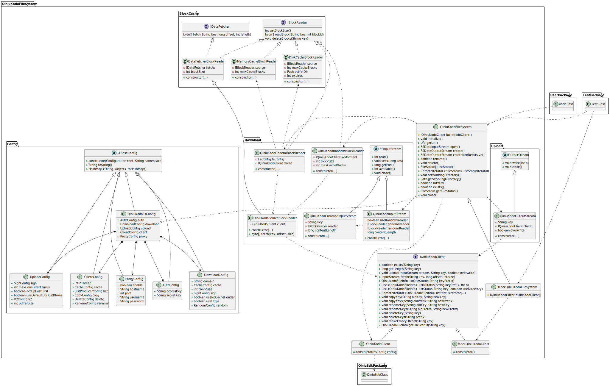
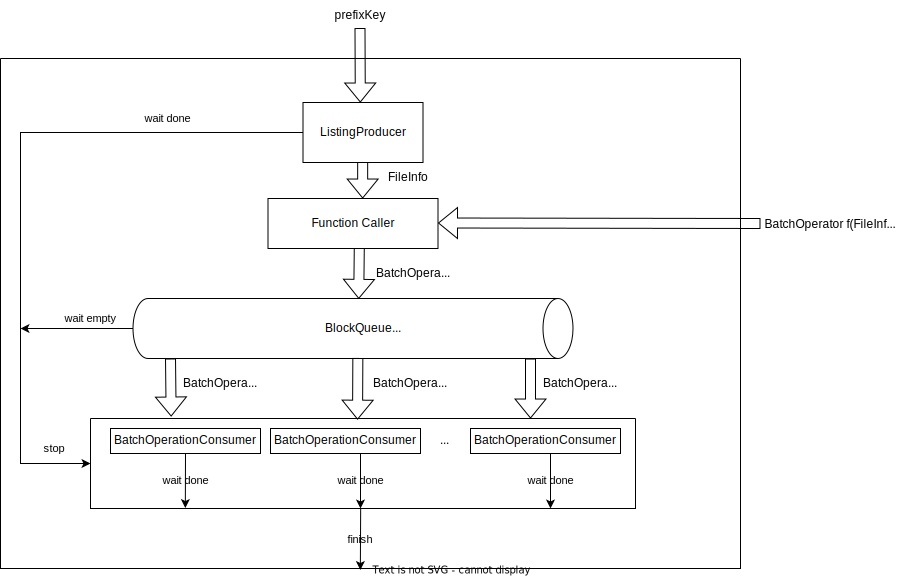

# Introduction

Qiniu Kodo is a self-developed unstructured data storage management platform by Qiniu Cloud Storage that supports center and edge storage.
The platform has been verified by a large number of users for many years and has been widely used in various scenarios of massive data management. It is widely used in many cloud service users in China, but currently in the Apache Hadoop project, there is a lack of a solution that supports Kodo through Hadoop/Spark native.

The purpose of this project is to integrate Kodo natively into Hadoop/Spark projects, so that users can operate Kodo through the API of Hadoop/Spark without additional learning costs.

# Features

+ Support Hadoop MapReduce and Spark read and write operations on Kodo
+ Implemented the Hadoop file system interface, and provided the same user experience as HDFS by simulating the hierarchical directory structure
+ Support large file multipart upload, up to 10TB single file
+ Use Kodo's batch api, with high-performance file system operation capabilities
+ Support file block-level cache in memory and block-level cache in disk, improve file read performance

> Note:
> Since the object storage is not a file system, there are some restrictions on the use: 
> 1. Object storage is a key-value storage, which does not support hierarchical directory structure, so it is necessary to use path separator to simulate hierarchical directory structure
> 2. Do not track the modification time and access time of the directory
> 3. Kodo object storage does not support file append writing, so data cannot be appended to the end of an existing file
> 4. Do not track the modification time of the file, so in the file system, the modification time of the file is the creation time of the file
> 5. The delete and rename operations are not atomic, which means that if the operation is interrupted unexpectedly, the file system may be in an inconsistent state
> 6. Object storage does not support unix-like permission management, so in the file system, the following rules need to be provided:
>    + Directory permission is 715
>    + File permission is 666
>    + File owner report the local current username
>    + File owner group report the local current username
> 7. The maximum number of files per list request is 1000
> 8. Support large file multipart upload, but the number of parts is limited to 10000. Since the maximum size of a single part is 1GB, the maximum single file is 10TB

# Concepts

+ **Bucket**: The container in which data is stored in Kodo, whose name is defined by the user
+ **AccessKey**: Used to identify the user's identity in Kodo
+ **SecretKey**: The key used to verify the user's identity in Kodo
+ **kodo**: In hadoop-kodo, `kodo` is used as its URI scheme

# Project Structure Design

The UML class diagram of this project is as follows:

First of all, from a high-level perspective, the `QiniuKodoFileSystem` class is the only interface for the entire system to interact with the user system. Assuming that `UserClass` represents the user system, `TestClass` represents the test module.

The project finally interacts with the Qiniu Cloud Object Storage backend through the Qiniu Java SDK. Assuming that `QiniuSdkClass` represents the Qiniu Java SDK.

The `QiniuKodoFileSystem` class inherits the `FileSystem` abstract class of `Hadoop`, and it needs to implement some abstract methods defined in the `FileSystem` abstract class.

The abstract structure of the system is analyzed in turn according to the core entry classes of each functional module:

## QiniuKodoFsConfig

The main function of this module is to encapsulate the configuration information of Qiniu Cloud Object Storage, including the AK/SK of Qiniu Cloud Object Storage, the configuration of download cache, etc.

The entry class of this module is `QiniuKodoFsConfig`, which combines other different configuration classes, such as the authentication configuration class `AuthConfig`, the download cache configuration class `DownloadConfig`, etc.

These configuration classes read the configuration information in XML through the `Configuration` class of `Hadoop`, and strictly deserialize the configuration information in the XML into the instances of each configuration class according to the hierarchical namespace.

All configuration classes inherit the abstract class `ABaseConfig`, which forces each subclass to pass the `Configuration` instance and the `namespace` string to construct the instance, thereby standardizing the hierarchical management of configuration information, and can be unified through the `toString()` method. Output configuration information string, serialize the configuration object through the unified `toHashMap` method. This is actually an application of the composite pattern.

Finally, other modules in the system can obtain configuration information through the `QiniuKodoFsConfig` class, without having to access the configuration information directly through the `Configuration` instance and the `key` string.

## QiniuKodoOutputStream

This module mainly constructs a `QiniuKodoOutputStream` class, which is an implementation class of Hadoop's `FSDataOutputStream` class. It is based on the `upload()` method in `IQiniuKodoClient`, `PipedStream` pipeline stream and `ExecutorService` thread pool.

Finally, the `QiniuKodoOutputStream` class will be constructed in the `create()` method of `QiniuKodoFileSystem`, thereby realizing the file upload function.

## QiniuKodoInputStream

Read File is the most complex part of the system. The complexity lies in the need to implement file block download, memory block-level cache, disk block-level cache, file random read and other functions, and give users the ability to enable or disable certain functions through configuration items.

A separate module for block-level caching of files is defined, and in the UML class diagram of this system, these classes are located in the `BlockCache` package.

Firstly, an interface called `IBlockReader` is defined, which includes a method called `readBlock()`. This method is used to read block data of a file based on a file identifier `key` and a block number, and returns a byte array representing the content of the block. `IBlockReader` also defines a method called `getBlockSize()`, which is used to get the block size of the `BlockReader`. The `deleteBlocks()` method is mainly used to delete all block caches of a file. In the `BlockCache` package, there are three implementations of `IBlockReader`, which are `MemoryCacheBlockReader`, `DiskCacheBlockReader`, and `DataFetcherBlockReader`. `MemoryCacheBlockReader` is used to read LRU block caches stored in memory, while `DiskCacheBlockReader` is used to read LRU block caches stored on disk. These two cache implementation classes are actually applications of the decorator pattern. `DataFetcherBlockReader` is an interface adapter used to adapt the `IDataFetcher` interface to the `IBlockReader` interface implementation, which is an application of the adapter pattern.

Then, some implementation classes about file downloading are defined in the `Download` package. Among them, the `QiniuKodoSourceBlockReader` class inherits from the `DataFetcherBlockReader` class and overrides its `fetch()` method. The implementation of this method actually calls the `fetch()` method of an instance of the `IQiniuKodoClient` class. Actually, this is an adapter that adapts the `IQiniuKodoClient` interface to the `IBlockReader` interface, which will be used to access files in object storage in the form of blocks.

A class called `QiniuKodoGeneralBlockReader` is defined, which implements the `IBlockReader` interface. It combines the metadata reading layer `QiniuKodoSourceBlockReader`, the memory cache reading layer `MemoryCacheBlockReader`, and the disk cache reading layer `DiskCacheBlockReader` to implement the final block reading interface.

A class called `QiniuKodoRandomBlockReader` is defined, which optimizes for random reading scenarios and does not use disk caching, only memory caching.

A class called `QiniuKodoCommonInputStream` is defined, which is an implementation class of Hadoop's `FSDataInputStream`. It is actually an adapter that wraps an instance of a class that implements the `IBlockReader` interface into an implementation class of `Hadoop`'s `FSDataInputStream`.

A class called `QiniuKodoInputStream` is defined, which dynamically switches between the general `IBlockReader` and the random `IBlockReader`, and implements the final file download class `QiniuKodoInputStream`. This is an embodiment of the strategy pattern.

Therefore, in the `open()` method of `QiniuKodoFileSystem`, we construct a `QiniuKodoInputStream` based on two different `IBlockReader`s, thus implementing the file download function.

## QiniuKodoFileSystem

The file system operations mainly include implementing methods such as `rename(), delete(), listStatus(), mkdirs(), exists(), getFileStatus()` in `QiniuKodoFileSystem`. These operations are entirely based on the methods in `IQiniuKodoClient`. For the implementation of the `rename()` and `delete()` methods, they are actually based on methods such as `copyKey(), copyKeys(), renameKey(), renameKeys(), deleteKey(), deleteKeys()` in `IQiniuKodoClient`.

## Integration Test

Assuming the test class in the integration test is called `TestClass`, it can be configured to use mock-based integration testing.

If mock-based integration testing is selected, the `MockQiniuKodoFileSystem` class will be constructed. It is a subclass of the `QiniuKodoFileSystem` class and overrides the `buildKodoClient()` method. It will construct an instance of the `MockQiniuKodoClient` class as the implementation class of the `IQiniuKodoClient` class in the `QiniuKodoFileSystem` class. This allows us to perform integration testing of the entire system without the need to connect to the real Qiniu cloud object storage backend.

If mock-based integration testing is not selected, the real `QiniuKodoFileSystem` class will be constructed. Its own `buildKodoClient()` method will directly construct an instance of the `QiniuKodoClient` class as the implementation class of the `IQiniuKodoClient` class in the `QiniuKodoFileSystem` class. Note that in this case, the system will connect to the real Qiniu cloud object storage Kodo server backend, so the AK/SK information of the Qiniu cloud object storage needs to be configured properly.

# Simulated File System Design

The main operations in the file system include the implementation of methods such as `rename(), delete(), listStatus(), mkdirs(), getFileStatus()`.

## getFileStatus(Path p)

The implementation of the `getFileStatus(Path p)` method is relatively simple. It directly calls the `QiniuKodoFileInfo getFileInfo(String key)` method in `IQiniuKodoClient`, converts its return value to the `FileStatus` type, and returns it. The field conversion process is as follows:

| Field in FileStatus | Conversion Process                                                                                     |
|:--------------------|:-------------------------------------------------------------------------------------------------------|
| length              | Direct mapping to the size of the object                                                               |
| isdir               | Look up if there is an empty object representing the folder corresponding to the path in the bucket    |
| blockSize           | Use the block size for block downloading defined in the configuration file                             |
| modification_time   | Direct mapping to the upload time of the object                                                        |
| access_time         | Direct mapping to the upload time of the object                                                        |
| permission          | File permission, folder uses permission 0715, file uses permission 0666                                |
| owner               | The system user where Hadoop is currently running                                                      |
| group               | The system user where Hadoop is currently running                                                      |
| path                | Map the key of the object to the path in the file system according to the specified path mapping rules |

## mkdirs(Path path)

The operation of creating a folder is actually creating an empty object in the Qiniu cloud object storage, with the object's key being the prefix of the specified path and ends with `/`. For example, if the specified path is `/test/`, an empty object with the key `test/` will be created in the Qiniu cloud object storage. If you want to create multiple levels of folders, you need to create each level of folder one by one. For example, if the specified path is `/test/test1/test2/`, you need to create three empty objects in the specified bucket, which are `test/`, `test/test1/`, and `test/test1/test2/`.

## listStatus(Path path)

Actually, there are two different `listStatus()` methods provided in Hadoop, which are `FileStatus[] listStatus(Path f)` and `RemoteIterator<FileStatus> listStatusIterator(Path f)`. The implementation of the `FileStatus[] listStatus(Path f)` method is to convert the `RemoteIterator<FileStatus>` object returned by the `RemoteIterator<FileStatus> listStatusIterator(Path f)` method into a `FileStatus[]` array and return it. Therefore, we only need to implement the `RemoteIterator<FileStatus> listStatusIterator(Path f)` method.

## RemoteIterator<FileStatus> listStatusIterator(Path f)

The implementation of this method is based on the common `listStatus` operation in object storage. The original method in the SDK for listing objects is `listStatus(String prefix, String delimiter, String marker, int limit)`, where:

1. `String prefix` indicates that all objects with the prefix `prefix` are listed in this operation.
2. `String delimiter` indicates the path separator. If this parameter is specified, the `commonPrefixes` field will be included in the return result.
3. `String marker` indicates the starting position of the list operation. If this parameter is specified, the `nextMarker` field will be included in the return result.
4. `int limit` indicates the maximum number of objects listed in this operation.

The return value of this method includes:

1. `FileInfo[] files` represents the metadata of all objects listed in this operation.
2. `String[] commonPrefixes` represents the shortest common prefix of all objects with the specified prefix, separated by the `delimiter` parameter. In fact, this parameter can be used to simulate the tree structure of the file system in the flat `Key/Value` model of object storage. It can be directly mapped to the concept of subfolders under the specified path in the file system. Therefore, folders do not contain any metadata, so the implementation of fields such as `modification_time` and `access_time` in `getFileStatus()` for folders are all 0.
3. `String nextMarker` indicates the starting position of the next list operation.

Therefore, calling the `listStatus(String prefix, String delimiter, String marker, int limit)` method repeatedly until the `nextMarker` field is empty can complete the entire list operation of the folder. The iterator pattern can be used to simplify the usage of this process.

## delete(Path path, boolean recursive)

To delete a given file or folder, deleting a file can be directly mapped to a call to the `delete` API in the SDK.

To delete a folder, the `deleteKeys(String prefix)` method in `QiniuKodoClient` is called to implement it.

## rename(Path src, Path dst)

Renaming a folder is actually achieved by first calling the `copyKeys(String oldPrefix, String newPrefix)` method to copy all objects with the specified prefix, and then calling the `deleteKeys(String prefix)` method to delete all objects with the specified prefix.

## Batch operation

The `copyKeys()`, `deleteKeys()`, `listStatus()`, and other methods used in the above implementation are all based on the efficient batch APIs provided by Qiniu cloud storage. A maximum of 1000 objects can be processed in a single request, so we can process these objects in batches until all objects are processed.

To further optimize the performance of these batch operations, we can use multithreading to operate on objects concurrently, in order to improve the batch processing performance at the folder level. This is actually a single-producer-multiple-consumer model, and we can use `BlockingQueue` to implement communication between producers and consumers. The diagram is as follows:

The user inputs a `prefixKey` and a mapping function `f` from `FileInfo` to `BatchOperator`. Subsequently, `ListingProducer` continually lists `FileInfo` objects, which are processed by `f` to obtain the `BatchOperator` object to be operated on. The `BatchOperator` object is then put into the `BlockingQueue`. The `BatchConsumer` continually takes the `BatchOperator` object from the `BlockingQueue`, accumulates enough tasks according to the configuration file, and then submits a batch request to the server. When the producer has finished producing and there are no `BatchOperator` objects to be processed in the `BlockingQueue`, it sends a stop request to all `BatchConsumer`s. At this point, all `BatchConsumer`s will submit their remaining tasks to the server and then exit. When all `BatchConsumer`s have completed their remaining tasks, the entire batch processing process ends.

# Limitation

Upload file using qiniu kodo v2 api, it supports multipart upload, the max part number is 10000, the max part size is 1GB. So the max file size is 10000GB, which is 10TB.
